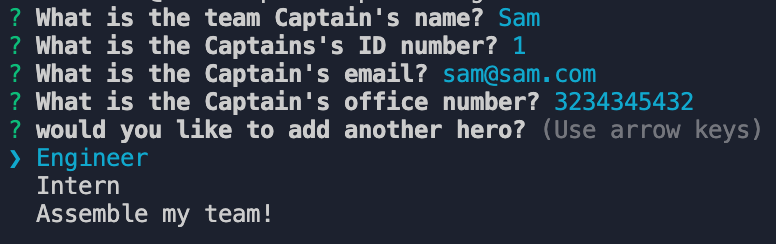
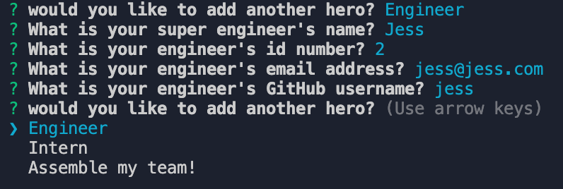
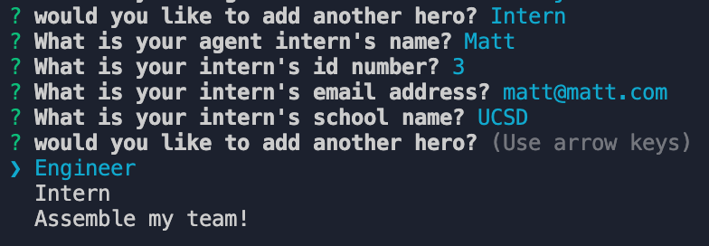
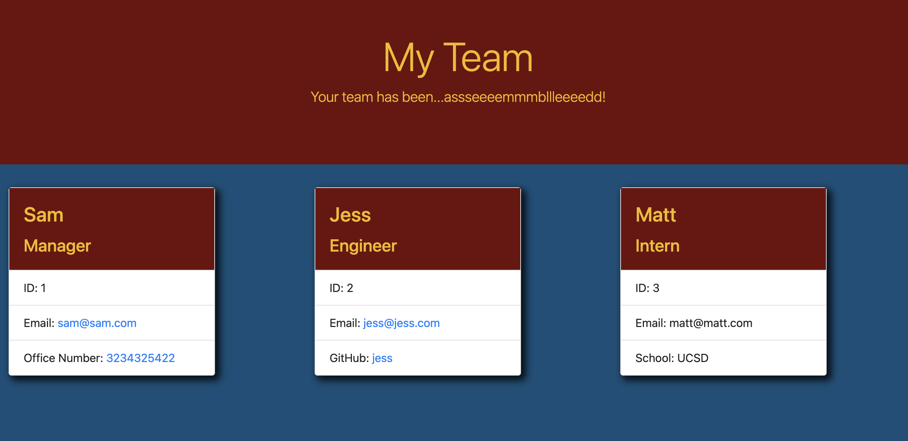

# Team Profile Generator Assemble!

## Introduction

Welcome to the Team Profile Generator Assembleeeee! Where you can assemble your team of earth's mightiest office mates. I created this program to give a fun twist on managing your team. You will be prompted to add a Captain (or Manager) to your team and then add as many super engineers or agent interns that you need to keep track of. This project did not come without it's challenges. From getting the cards to show, to getting the questions to cycle, this app really kept me on my toes. I learned quite a bit about template literals and the use of functions with the inquirer prompt. I mapped out many ways that this project could have been achieved, but landed on the function method as it is one I have used before and seemed more comfortable for me.

## Installation

No need to install this app. You can run it by typing "node index.js" in your terminal.

## Link to Video Demo

https://drive.google.com/file/d/1ly4kJkrLD9somDnEIypxAhRmhu5HfeZw/view

## Screenshots

Questions for Manager

Questions for Enginner

Questions for Intern

Final HTML output

## Credits

I do have to give a big shoutout to my friend Ryan who helped me immensely on figuring out how to get my functions to spit out actual HTML elements, as that was one issue that seemed to never end!

Also would not have been possible without Inquirer and Jest for testing.